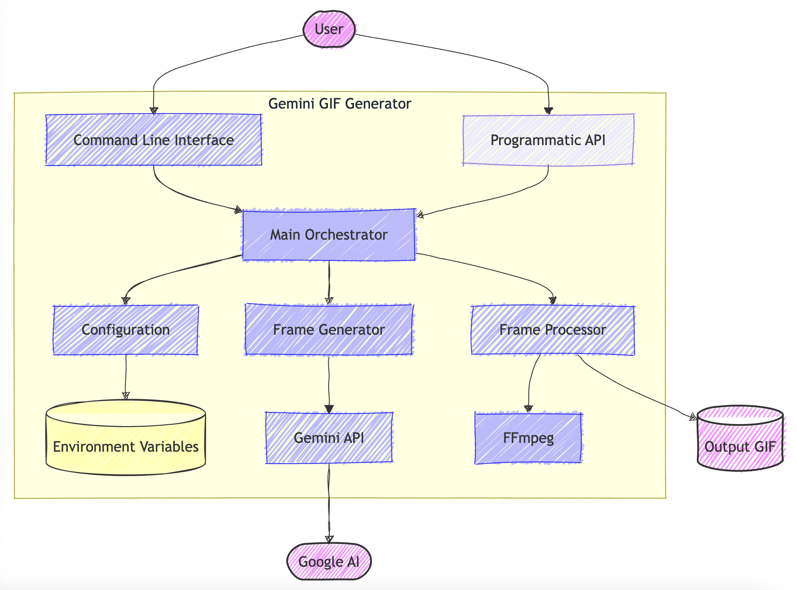
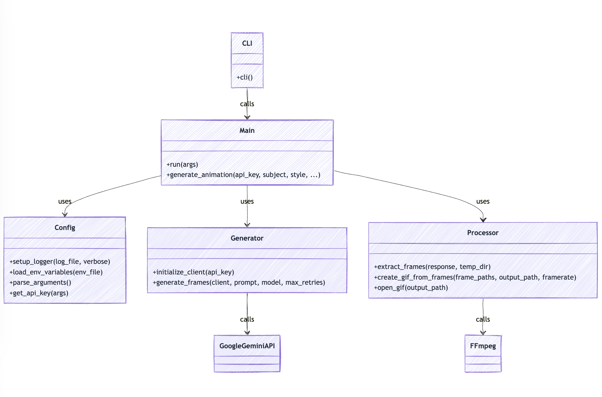
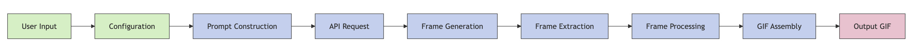

# Gemini GIF Generator - Architecture Documentation

This document provides a detailed overview of the Gemini GIF Generator architecture, including component relationships, data flow, and design decisions.

## Table of Contents

1. [System Overview](#system-overview)
2. [Component Architecture](#component-architecture)
3. [Data Flow](#data-flow)
4. [Key Components](#key-components)
5. [Sequence Diagrams](#sequence-diagrams)
6. [Design Decisions](#design-decisions)
7. [Future Improvements](#future-improvements)

## System Overview

Gemini GIF Generator is a Python tool that leverages Google's Gemini API to generate animated GIFs from text prompts. The system takes a text description and style preference as input, sends requests to the Gemini API to generate multiple frames, and then processes these frames into a cohesive animated GIF.



*Figure 1: High-level system overview showing the main components and their interactions.*

## Component Architecture

The project follows a modular architecture with clear separation of concerns. The codebase is organized into the following main components:

```
gemini-gif/
├── gemini_gif/
│   ├── __init__.py         # Package metadata and version
│   ├── cli.py              # Command-line interface
│   └── core/               # Core functionality
│       ├── __init__.py
│       ├── config.py       # Configuration and settings
│       ├── generator.py    # Frame generation using Gemini API
│       ├── main.py         # Main orchestration logic
│       └── processor.py    # Frame processing and GIF creation
├── tests/                  # Unit and integration tests
└── examples/               # Example usage scripts
```



*Figure 2: Component architecture showing the relationships between different modules.*

## Data Flow

The data flow through the system follows these steps:

1. **Input Processing**: User inputs (subject, style, etc.) are collected via CLI or API
2. **Configuration**: System loads environment variables and configures settings
3. **API Interaction**: Requests are sent to Gemini API with constructed prompts
4. **Frame Generation**: Multiple frames are generated by the AI model
5. **Frame Processing**: Frames are extracted and processed
6. **GIF Creation**: Processed frames are assembled into an animated GIF
7. **Output**: The final GIF is saved to the specified location



*Figure 3: Data flow diagram showing how information moves through the system.*

## Key Components

### CLI Module (`cli.py`)

The CLI module provides the command-line interface for the tool. It:
- Parses command-line arguments
- Loads environment variables
- Calls the main process
- Handles exit codes

### Config Module (`config.py`)

The Config module handles all configuration-related functionality:
- Loads environment variables from `.env` files
- Defines default values for parameters
- Parses command-line arguments
- Sets up logging
- Retrieves API keys from various sources

### Generator Module (`generator.py`)

The Generator module is responsible for interacting with the Gemini API:
- Initializes the Gemini client
- Constructs prompts for the API
- Sends requests to generate frames
- Implements retry logic for better results
- Handles API errors and rate limiting

### Processor Module (`processor.py`)

The Processor module handles the processing of generated frames:
- Extracts frames from API responses
- Saves frames to temporary files
- Creates GIFs from frame sequences using imageio for better compatibility
- Handles image processing and optimization
- Opens the generated GIF for preview

### Main Module (`main.py`)

The Main module orchestrates the entire process:
- Coordinates between different components
- Manages the overall workflow
- Provides both programmatic and CLI interfaces
- Handles error conditions and reporting

## Sequence Diagrams

### Basic Usage Flow

The following sequence diagram illustrates the typical flow when using the command-line interface:

```
┌─────┐          ┌─────┐          ┌──────────┐          ┌─────────┐          ┌──────────┐          ┌───────────┐
│ CLI │          │Main │          │ Config   │          │Generator│          │Processor │          │ Gemini API│
└──┬──┘          └──┬──┘          └────┬─────┘          └────┬────┘          └────┬─────┘          └─────┬─────┘
   │                │                   │                     │                     │                      │
   │ Parse Args     │                   │                     │                     │                      │
   │───────────────>│                   │                     │                     │                      │
   │                │                   │                     │                     │                      │
   │                │ Load Config       │                     │                     │                      │
   │                │──────────────────>│                     │                     │                      │
   │                │                   │                     │                     │                      │
   │                │ Get API Key       │                     │                     │                      │
   │                │──────────────────>│                     │                     │                      │
   │                │                   │                     │                     │                      │
   │                │ Initialize Client │                     │                     │                      │
   │                │────────────────────────────────────────>│                     │                      │
   │                │                   │                     │                     │                      │
   │                │ Generate Frames   │                     │                     │                      │
   │                │────────────────────────────────────────>│                     │                      │
   │                │                   │                     │                     │                      │
   │                │                   │                     │ API Request         │                      │
   │                │                   │                     │─────────────────────────────────────────>  │
   │                │                   │                     │                     │                      │
   │                │                   │                     │ API Response        │                      │
   │                │                   │                     │ <─────────────────────────────────────────>│
   │                │                   │                     │                     │                      │
   │                │ Process Frames    │                     │                     │                      │
   │                │──────────────────────────────────────────────────────────────>│                      │
   │                │                   │                     │                     │                      │
   │                │ Create GIF        │                     │                     │                      │
   │                │──────────────────────────────────────────────────────────────>│                      │
   │                │                   │                     │                     │                      │
   │ Return Result  │                   │                     │                     │                      │
   │<───────────────│                   │                     │                     │                      │
   │                │                   │                     │                     │                      │
┌──┴──┐          ┌──┴──┐          ┌────┴─────┐          ┌────┴────┐          ┌────┴─────┐          ┌─────┴─────┐
│ CLI │          │Main │          │ Config   │          │Generator│          │Processor │          │ Gemini API│
└─────┘          └─────┘          └──────────┘          └─────────┘          └──────────┘          └───────────┘
```

*Figure 4: Sequence diagram showing the interaction between components during a typical GIF generation process.*

### Retry Logic Flow

The following sequence diagram illustrates the retry logic when insufficient frames are generated:

```
┌─────────┐                                  ┌───────────┐
│Generator│                                  │ Gemini API│
└────┬────┘                                  └─────┬─────┘
     │                                             │
     │ Initial Request                             │
     │────────────────────────────────────────────>│
     │                                             │
     │ Response (insufficient frames)              │
     │<────────────────────────────────────────────│
     │                                             │
     │ Retry with Enhanced Prompt                  │
     │────────────────────────────────────────────>│
     │                                             │
     │ Response (sufficient frames)                │
     │<────────────────────────────────────────────│
     │                                             │
┌────┴────┐                                  ┌─────┴─────┐
│Generator│                                  │ Gemini API│
└─────────┘                                  └───────────┘
```

*Figure 5: Sequence diagram showing the retry logic when insufficient frames are initially generated.*

## Design Decisions

### Modular Architecture

The project uses a modular architecture to promote:
- **Separation of concerns**: Each module has a specific responsibility
- **Testability**: Components can be tested in isolation
- **Maintainability**: Changes to one component don't affect others
- **Extensibility**: New features can be added with minimal changes

### Command-Line Interface

The CLI was designed to be:
- **User-friendly**: Sensible defaults and clear help messages
- **Flexible**: Multiple ways to provide configuration
- **Robust**: Proper error handling and reporting
- **Scriptable**: Can be easily integrated into scripts and workflows

### Error Handling and Retry Logic

The system implements sophisticated error handling:
- **Automatic retries**: When the API returns insufficient frames
- **Enhanced prompts**: Retry with more specific instructions
- **Rate limiting**: Handles API rate limits gracefully
- **Comprehensive logging**: Detailed logs for troubleshooting

### Temporary File Management

The system uses temporary directories to:
- **Avoid clutter**: Files are automatically cleaned up
- **Ensure uniqueness**: No conflicts between multiple runs
- **Handle large files**: Efficiently process large frame sets

## Future Improvements

Potential areas for future enhancement include:

1. **Advanced Frame Processing**:
   - Frame interpolation for smoother animations
   - Style transfer between frames
   - Frame optimization for smaller file sizes

2. **Enhanced User Experience**:
   - Web interface for easier interaction
   - Preview functionality during generation
   - More customization options

3. **Performance Optimizations**:
   - Parallel processing of frames
   - Caching of common requests
   - Streaming responses for faster feedback

4. **Integration Capabilities**:
   - Webhooks for notification
   - API for third-party integration
   - Batch processing capabilities 