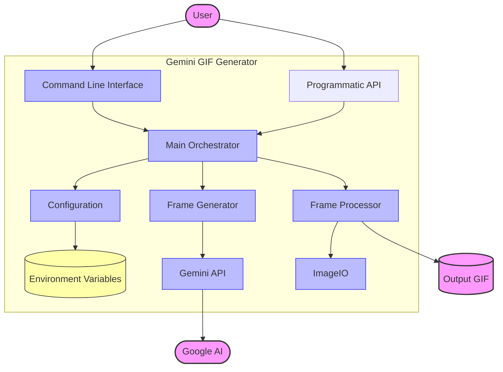

# Diagrams for Architecture Documentation

This file contains the Mermaid diagrams used in the architecture documentation. These can be rendered using the Mermaid Live Editor (https://mermaid.live/) or any Mermaid-compatible tool.

## System Overview



## Component Architecture

```mermaid
classDiagram
    class CLI {
        +cli()
    }
    
    class Main {
        +run(args)
        +generate_animation(api_key, subject, style, ...)
    }
    
    class Config {
        +setup_logger(log_file, verbose)
        +load_env_variables(env_file)
        +parse_arguments()
        +get_api_key(args)
    }
    
    class Generator {
        +initialize_client(api_key)
        +generate_frames(client, prompt, model, max_retries)
    }
    
    class Processor {
        +extract_frames(response, temp_dir)
        +create_gif_from_frames(frame_paths, output_path, framerate)
        +open_gif(output_path)
    }
    
    CLI --> Main : calls
    Main --> Config : uses
    Main --> Generator : uses
    Main --> Processor : uses
    Generator --> "Google Gemini API" : calls
    Processor --> "ImageIO" : calls
```

## Data Flow

```mermaid
flowchart LR
    Input[User Input] --> Config[Configuration]
    Config --> Prompt[Prompt Construction]
    Prompt --> API[API Request]
    API --> Frames[Frame Generation]
    Frames --> Extract[Frame Extraction]
    Extract --> Process[Frame Processing]
    Process --> Assemble[GIF Assembly]
    Assemble --> Output[Output GIF]
    
    classDef input fill:#d0f0c0,stroke:#333
    classDef process fill:#c0d0f0,stroke:#333
    classDef output fill:#f0c0d0,stroke:#333
    
    class Input,Config input
    class Prompt,API,Frames,Extract,Process,Assemble process
    class Output output
``` 

